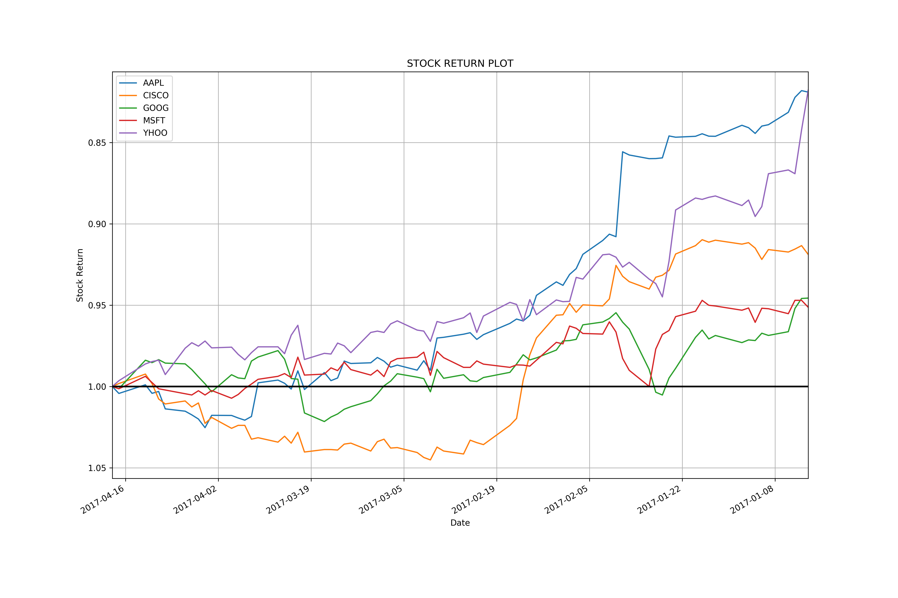

# INFO 7374 Data Analysis Using Python - Final Project

## Finance Market Data Analysis using API

## Motivation to Choose Finance Market Analysis

The finance market industry is all about loads of numeric data which can be analysed and visualized efficiently using Python and its built in libraries. 
To gain insights about the finance industry.

## Contents of ReadMe
1. Background
2. Data Collection and Storing
3. Analysis Performed
     a)Analysis 1
     b)Analysis 2
     c)Analysis 3
4. Final Conclusion

## 1. Background

Financial Market Analysis deals with particluar market shares upon the performance of the total number of shares that are traded in that market. On a given day when the market closes with the prices of most of its securities on the higher side, then it could be said to have performed well. 

Three analysis on the financial data has been done in Python using libraries such as pandas, matplotlib and requests.

## 2. Data Collection and Stroing

The API method has been chosen to collect data instead of the dataset, using the API method live data can be captured as and when required to run the project. 
API from which data has been retrived is Quandl - https://www.quandl.com/ 

The API has been hit using the requests library of python and the API-key has been stored in the environment variables.

The data of different shares have been stored in the csv and even a master data set has been formed.

 * Click <a href="data">here</a> to view the data generated from Quandl
 
The top technology firms, banks and automobile industry data has been downloaded for analysis
 
 
## 3. Analysis Performed

There are three analysis performed on the data captured which are helpful in visualizing.

### a) Analysis 1

Topic - To Analyse which share of the technology market has maximum returns.

Packages Used -:

- pandas
- datetime
- matplotlib

**Steps:**

1. The technology firms csv files containing market data are read.

2. Each of them are fed into a dataframe, while fetching data into a dataframe only 2017 years data has been filtered.

3. A dataframe is created by using the join method to store all the technology companies data to be analysed.

4. The stock return is calculated using the lambda function.

5. The stock return is plotted to analyse and see which stocks have grater stock return.

6. From the above plot we can analyse that the top three technology shares are of Apple, Yahoo and Cisco

7. A function has been created to plot the candlestick graph.

A candlestick chart (also called Japanese candlestick chart) is a style of financial chart used to describe price movements of a security.It plots the Open, High, Close and Low of a security per day. 

 8. The candlestick graph of the Apple is plotted as below, black indicates the price has increased and red decreased   as compared to the previous day.

### Outputs

Plot Files: <a href="analysis/ana_1">Plots</a>

### Conclusion

- The top technology firms are Yahoo, Cisco and Apple
- The trends when observed from the candlestick graph show that there is a lot of increase in Apple shares daily as       compared to others

### a) Analysis 2

Topic - To plot moving average.
        To read the daily changes becomes difficult sometimes as the change is not clearly visible, so the moving    average plot makes the plot more readable
        - The percentage daily return is calculated and plotted

Packages Used -:

- pandas (Series, Dataframe and Datareader)
- datetime
- matplotlib

**Steps:**

1. The technology firms csv files containing market data are read.

2. Each of them are fed into a dataframe, while fetching data into a dataframe only 2017 years data has been filtered.

3. An Adjusted closing price is calculated and used in the analysis- An adjusted closing price is a stock's closing price on any given day of trading that has been amended to include any distributions and corporate actions that occurred at any time prior to the next day's open

4. The moving average is calculated using the Adjusted closing price by using the rolling mean function of the pandas.

5. A for each mechanism has been used to plot the moving averages of the shares required to be analysed using the plot.

8. The percentage daily return is calculated and displayes using the plot

### Outputs

Plot Files: <a href="analysis/ana_2">Plots</a>

### Conclusion

- The moving average calculated and plotted agains the adjusted closing makes a better source for investors or finance technology companies to analyse stocks
- The trends when observed from the percentage daily return plot help investors analyze and visualize the share market.
- Any industries shares/securities can be analyzed using this code.

### a) Analysis 3

Topic - The third analysis has been done to compare the shares of the technology firms using different mechanisms, this would advice and give a clear contrasting picture for an individual to choose wisely.
This would also analyze the change in comparison to other shares/securites when the marked is low/high.

Packages Used -:

- pandas (Series, Dataframe and Datareader)
- datetime
- matplotlib
- seaborn
- numpy

**Steps:**

1. The technology firms csv files containing market data are read and only required columns are selected into a dataframe.

2. While fetching data into a dataframe only 2017 years data has been filtered.

3. A dataframe is created by using the concatenate method to store all the related adjusted closing records of the firms to be compared and contrasted.

4. The four technical firms percentage return is calcluated.

5. A join plot to compare the daily return of Microsoft and Cisco are plotted

6. A pair grid has been plotted plotted of all the four companies to determine the correlation.
   A pair grid of seaborn has been used as it gives full control and is the best when comes to comparing and contrasting. 

8. As the above plot is difficult to read and make a decision of the correaltion between shares, the numerical values of correlation are plotted using the heatmap.

9. The next step is the risk analysis, which is plotted comparing the expected return versus the standard deviation.

### Outputs

Plot Files: <a href="analysis/ana_3">Plots</a>

### Conclusion

- The joint plot of Microsoft and Cisco show that there is a weak correlation i.e 0.36, the scattered plot also shows that there is no trend line being formed, hence they is a weak correlation between them.
- A quick glane at the pair grid formed by seaborn tells us that there is a better correlation between microsoft and cisco, but it does not give a clear idea. The heatmap has been plotted to show the numerical comparison between them.
- The heatmap tells us that there is a better correaltion of 0.36 between Microsoft and Cisco. This tells that inside the technology industry Microsoft and Cisco being core networking companies have similar trends.The trends could be due to a change of the products which are common to them.
- The risk plot tells us that Google and Microsoft have almost the same returns and risk when compared to others, so we can choose both of them in contrast to others to invest. 

